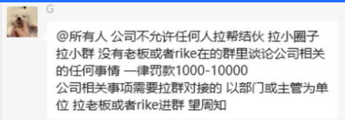
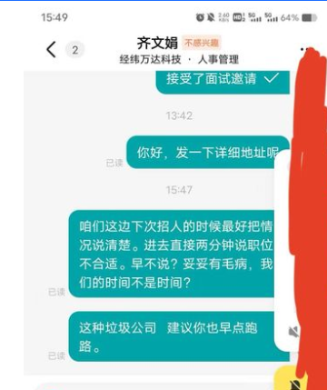

### 公司黑名单

| 公司名                                                       | 公司地址（填城市）                  | 优点                                                         | 有哪些坑？                                                   | 团队情况/人员数量                                            |
| ------------------------------------------------------------ | ----------------------------------- | ------------------------------------------------------------ | ------------------------------------------------------------ | ------------------------------------------------------------ |
| 更多避坑名单：小程序坑否 、[成都公司黑名单](https://github.com/Hootrix/Chengdu-IT-company-blacklist)  入职之前背调公司：  1.百度公司名称  2.从搜索结果中进入爱企查  3.往下划，划到立案信息  4.看该公司是否有劳动纠纷。 也可进入裁判文书网，先注册，然后输入公司名称查询该公司的案件（只能查到已结束的）  大部分人嫌麻烦是懒得去仲裁的，在这种前提下，如果还有公司有劳动仲裁纠纷就要注意了，谨慎入职该公司 | 如果要新增黑名单公司，请提issue或pr | **面试的时候先看看公司， 如果公司成立十来年了， 规模还是20-99人这种， 这么久了还发展不起来， 老板绝对是有点问题的** |                                                              |                                                              |
| 成都亿格人居科技有限公司                                     | 成都                                | 有年终奖，每年有调薪                                         | 经常加班，发版更是加班到两三点。 有的项目组没事做也要你在公司加班 夫妻店，老板在办公室装了监控，时常从监控看你电脑屏幕 不对就直接钉钉钉你，问你在干什么 公司无技术大佬，技术稍微好点的都走光了 | 前端几个，有几个项目组                                       |
| 野马科技                                                     | 成都                                | 无                                                           | 试用期疯狂让你加班，试用期满就裁员 离职人事还拿背调威胁你，让你不要仲裁 公司后端极度难沟通，经常性已读不回 偷偷改接口字段名，不告诉前端 测试提bug了，前端才知道 | 有几个前端                                                   |
| 成都瀚涛天图                                                 | 成都                                | 13薪                                                         | 连续好几天加班到两三点 去甲方出差没事做也要你装样子加班到89点 出差没车补没餐补，啥也没有 外包企业，面试的时候问，还说自己不是外包 | 项目多，前端也多，但是外包                                   |
| 希望集团                                                     | 成都                                | 有年终奖 有调薪 假期多 待遇一般                              | 自研项目 领导傻逼 加班无偿 画大饼                            | 前端现在4个 ，后端15个                                       |
| 杭州阔知网络科技                                             | 成都                                | 无                                                           | 项目全是php，一堆屎山，天天改bug，没一点提升。 项目忙的时候疯狂让你加班，项目忙完就裁人。 不忙的时候也让你加班，杭州总部强制要求每天在公司待到晚上8点 加班攒的调休也不让你用，说你调休用多了 | 前端2个，其余全是后端和测试                                  |
| 橙风科技                                                     | 成都                                | 无                                                           | 这公司好像常年招人，我每次找工作都能看到他在招聘， 建议别去，多半有坑， 每周一周二固定加班到九点，大小周 |                                                              |
| 安科思软件（成都）有限公司-AAXIS                             | 成都                                | 公司早餐                                                     | 披着外企的皮，实际上和国内的公司没区别 就是个外包。忙的时候天天加班，甚至项目组领导周末让你在家加班，还没调休，白加班 需要人的时候就招人，不需要人的时候就裁员 工资中有1/3是绩效，你有事做，填了工时以后才给你发绩效 如果没事做，那你1/3的工资就没了，不给你发 并且这1/3的工资，下个月发一半，还有一半留着每个季度一起发给你 如果你在季度结束之前被裁或者离职，你这个工资就没了，不会给你补发 | 前后端都比较多                                               |
| 珠海爱浦京科技有限公司                                       | 珠海/广州                           | 无                                                           | 三个月试用期无公积金，无绩效。工作日加班无偿， 外包公司，甲方要工作日加班就得无偿加（没有调休，餐补，加班费） | 哪里有项目就在哪里临时招人                                   |
| 深圳盛凯科技                                                 | 深圳                                | toG项目                                                      | 经理靠舔老板深圳买了车买了房，天天在炫这东西, 很看不起干了两三年就跳槽的，以自己呆了10年+为荣 | 内部前端+外包出去的前端 十几个                               |
| PPTutor                                                      | 成都                                | 无                                                           | 996，加班严重，不忙的时候加班到8点多，忙的时候加班到10点左右 并且和员工有好几起仲裁纠纷 | 技术团队10人左右，前端3个                                    |
| 深圳市誉托科技有限公司                                       | 深圳                                | 无                                                           | 外包公司，垃圾啊，开人从不赔偿，没有任何福利， 下午茶就给你发5毛钱的鸡爪，一吃一个不吱声 |                                                              |
| 上海云洞科技股份有限公司                                     | 上海                                | 无                                                           | 傻逼公司，只给3天时间做官网，一共8个页面还需要适配移动端还要有动画效果，说弄不出来被开除 | 一个前端，还需要会UI设计                                     |
| 中电金信                                                     | 哪都有，我在天津                    | 如果你能正常有活干，每月5日是能 发工资的                     | 如果公司没项目了，就让你请假，请假是没工资的，没项目太久了就让你签一个待岗调薪的 合同，然后就开除你，五险一金极低，面试时候hr跟你说不加班，但是招人的基本都玩命加，运气好你干完这个项目能去个不加班的，运气不好，你可能连续997之后就没项目了，就没工资了，或者出差什么的。 | 看情况，都不固定                                             |
| 成都酷推网络科技有限公司                                     | 成都                                | 刘姓氏家族企业，做游戏的 有点钱                              | 公司氛围极差，里面尽是小人，不懂编程技术，硬碰瓷软件行业 公司的人事 也有自知之明： 贴图在后排 |  |
| 长沙向晴科技，深圳荀墨科技， 北京戴坤科技 都是一个老板       |                                     | 做高利贷款的 有五险 小公司 制度跟餐饮店一样                  | 这是我职业生涯 遇到最傻逼的公司 一个app开发一周让你搞定  不管你是不是新来的还是熟不熟悉业务 接下来就是换样式 3-4天  搞不定就扣绩效 关键是你加班加点赶出来了  产品那边反而不催你了 就一直晾着  产品就是催进度的 根本不能提供你需求 千万别去 | 长沙 4个左右 深圳 4-50个左右 北京10个左右                    |
| 四川经纬万达科技有限公司                                     | 成都                                | 面试拿人刷kpi                                                |  |                                                              |
| 上海酷盒                                                     | 成都                                | 七天之后签订劳动合同， 但是劳动合同上的名字不是这家 技术模式也离谱 （虽然是vue） 8K让去搭建一套低代码版本   他返的那些全是一长串字符串   ，你根本看不懂代表啥东西（有技术文档，根本不想看）。所有的渲染   全是根据一个对象去动态渲染组件。 |                                                              |                                                              |
| 成都康赛                                                     | 成都                                | 无优点                                                       | 避雷，不发工资。70的基本30的绩效                             | 四五个前端，六七个后端。三四个测试                           |
| 天府星空集团                                                 | 成都                                | 无                                                           | 发过简历后马上约面试，都不和你商量面试时间， 问你什么时候有空，直接一个面试发过来。 然后进公司先让你填表，填完以后， 喊你进去面试，就问了几个问题 三分钟不到，就说面试结束了 感觉是拿人刷kpi，还长期在招人 并且有其他人面过这家，也是同样的问题 |                                                              |
